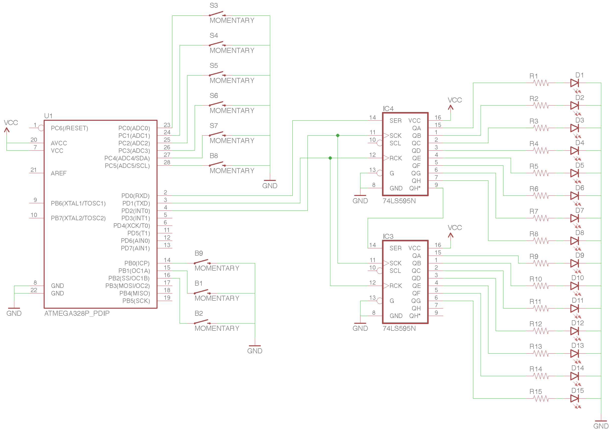

# Gums

> A number guessing game.

## Introduction

The point of the game is to guess a 4-digit number.  The game will randomly generate the number, and you use the numbered buttons to guess it.  As you press number buttons, some LEDs will light up telling you how many numbers you've entered.  Once you enter four, a set of LEDs will tell you how many of the numbers are correct and another set of LEDs will tell you how many are ordered correctly.  Once you get the order right, all the LEDs will flash (you won).

### Notes

I needed to create a timer so that I could seed the random number generator.  However, this messed up avr's `_delay_ms` function, so I had to use the timer to create a sort of delay.  It's not exact, but it works well enough for this.

I'm using the internal pull-up resistors for the buttons, so I didn't need external resistors for them (I think).

I implemented a simple debounce on the buttons.

## Ingredients

* [ATMega328P](https://www.sparkfun.com/products/9061)
* 2x [SN74HC595 8-bit Shift Registers](https://www.sparkfun.com/products/13699)
* 9x [Momentary Pushbuttons](https://www.sparkfun.com/products/9190)
* 12x Resistors
* 12x LEDs

## Install

_NOTE: The makefile uses `avr-gcc` and `avrdude` to compile and upload. It also assumes you're using a `usbtiny` programmer, like the Sparkfun Pocket AVR Programmer._

1.  Connect your programmer

1.  Compile and upload

    ```
    $ make upload
    ```

## Schematic



_I created the schematic using [Eagle](https://cadsoft.io/)._

## Photos

This is the prototype on a breadboard.  There's some electical tape covering the LED connections, but you should be able to discern them from the schematic.


## Resources

* [AVR Programming](https://github.com/cullylarson/avr-programming)
* [C Constants for ATMega328P](https://github.com/vancegroup-mirrors/avr-libc/blob/master/avr-libc/include/avr/iom328p.h)
* [Info on creating a timer](http://electronics.stackexchange.com/questions/22584/arduino-better-microsecond-resolution-than-micros)
* [Example timer code](http://arduinomega.blogspot.com/2011/05/timer2-and-overflow-interrupt-lets-get.html)
* [SN74HC595 Datasheet](http://www.ti.com/lit/ds/symlink/sn74hc595.pdf)
* [ATMega328 Datasheet](http://www.sparkfun.com/datasheets/Components/SMD/ATMega328.pdf)
* [Debounce Guide](assets/debounce-guide.pdf)
* [Video on Debouncing](https://www.youtube.com/watch?v=RzVc3o0iedM)
* [Arduino C Code on Github](https://github.com/arduino/Arduino/tree/master/hardware/arduino/avr/cores/arduino)

### Pin Layouts


